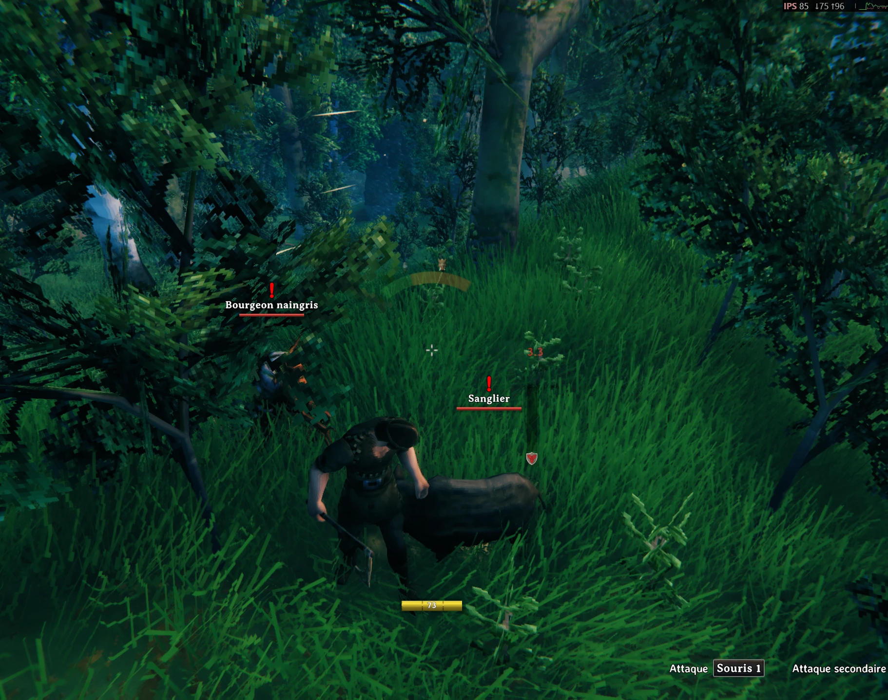
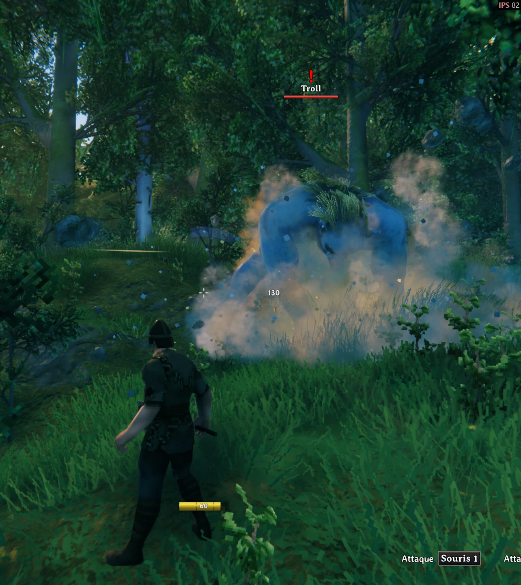

# EyesOfHeimdall

> *Heimdall entend l'herbe pousser et voit à des centaines de kilomètres. Ce mod prête un peu de ça à quelqu'un qui n'a qu'une oreille.*

Un mod Valheim qui **rend visible la direction des sons** — pour un joueur qui
n'entend que d'une oreille et n'a donc aucun repère interaural (ITD/ILD) pour
savoir d'où vient un bruit. Ce n'est pas un radar permanent façon wallhack :
rien ne s'affiche tant qu'aucun son ne se produit. Chaque son fait apparaître
un arc bref autour du viseur, dans la bonne direction, avec l'icône réelle de
la créature qui l'a émis.

## En jeu

<p align="center">
  
  &nbsp;&nbsp;
  
</p>

## Comment ça marche

- Un patch [Harmony](https://harmony.pardeike.net/) sur `ZSFX.Play()` (le
  système de sound effects de Valheim) observe chaque son joué dans le monde
  — sans jamais modifier le comportement du jeu.
- La créature à l'origine du son est identifiée via sa hiérarchie, ou, pour
  les effets d'impact/mort qui ne sont pas attachés à leur source (cas
  fréquent dans Valheim), via la créature vivante la plus proche du point
  sonore.
- Chaque créature du jeu (base + Mistlands/Ashlands/Deep North, ~160
  entités) est cataloguée avec une couleur, et son **icône de trophée réelle**
  est extraite de l'atlas d'icônes du jeu pour l'affichage — pas de nom
  technique, pas de texte : si aucune icône n'est disponible, rien ne
  s'affiche plutôt qu'un indice bancal.
- Plusieurs sons d'une même créature (pas, grognement, coup...) fusionnent en
  un seul repère plutôt que de s'empiler.
- Le cœur du calcul (direction/distance, cycle de vie des sons affichés) est
  agnostique du moteur de jeu — le mod Valheim n'est qu'un connecteur
  au-dessus.

## Installation (joueur)

Le mod fonctionne uniquement côté client : inutile que les autres joueurs
d'une même partie l'aient aussi installé.

**Le plus simple** : télécharge le zip de la dernière
[Release](../../releases/latest), dézippe-le, ferme Valheim s'il est ouvert,
double-clique `Installer.bat`. Le script trouve Valheim tout seul dans la
plupart des cas (sinon il demande le chemin), installe
[BepInEx](https://valheim.thunderstore.io/package/denikson/BepInExPack_Valheim/)
s'il n'est pas déjà présent, puis dépose le mod. Pour désinstaller :
`Desinstaller.bat` dans le même dossier.

Les scripts eux-mêmes sont dans [`installer/`](installer/) si tu préfères
les lire avant de les lancer, ou les adapter — il te faudra alors compiler
le mod toi-même (voir plus bas) et placer les deux DLL à côté des scripts.

Réglages (générés au premier lancement dans
`BepInEx/config/com.eyesofheimdall.valheim.cfg`) :
- `DetectionRangeMeters` — portée de détection (mètres)
- `HideOwnSounds` — masquer les sons produits par le joueur lui-même (pas, coups...)

## Build (dev)

Prérequis : SDK .NET, Valheim installé, BepInEx installé dans le dossier du
jeu.

```bash
dotnet build src/EyesOfHeimdall.ValheimMod/EyesOfHeimdall.ValheimMod.csproj -c Release
```

Le build copie automatiquement le mod dans
`<Valheim>/BepInEx/plugins/EyesOfHeimdall/` (chemin par défaut dans le
`.csproj`, override avec `-p:ValheimDir=...`). Logs :
`<Valheim>/BepInEx/LogOutput.log`.

## Architecture

```
src/
  EyesOfHeimdall.Core/        agnostique du moteur — modèle de "sons actifs",
                               calcul direction/distance
  EyesOfHeimdall.ValheimMod/  connecteur Valheim (BepInEx/Harmony) : patch
                               ZSFX, catalogue de créatures, rendu overlay
```

L'idée à terme : un seul cœur, plusieurs connecteurs moteur — Valheim est le
premier, pas le seul visé.

## Pistes

- Distinguer danger réel (créature hostile en chasse) vs bruit de fond
  (faune passive/fuyante).
- Retour haptique directionnel (vibration manette asymétrique gauche/droite).
- Indiquer si un son se rapproche ou s'éloigne dans le temps.
- Deuxième connecteur moteur pour valider l'architecture "un cœur, plusieurs
  moteurs".

## Origine du projet

Cadré et fait mûrir avec [BMAD-METHOD](https://github.com/bmad-code-org/BMAD-METHOD)
avant l'implémentation — le journal de la session de brainstorming est dans
[`_bmad-output/`](_bmad-output/).
