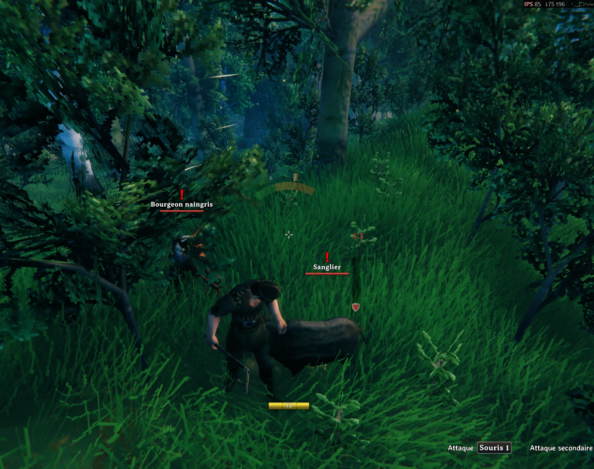
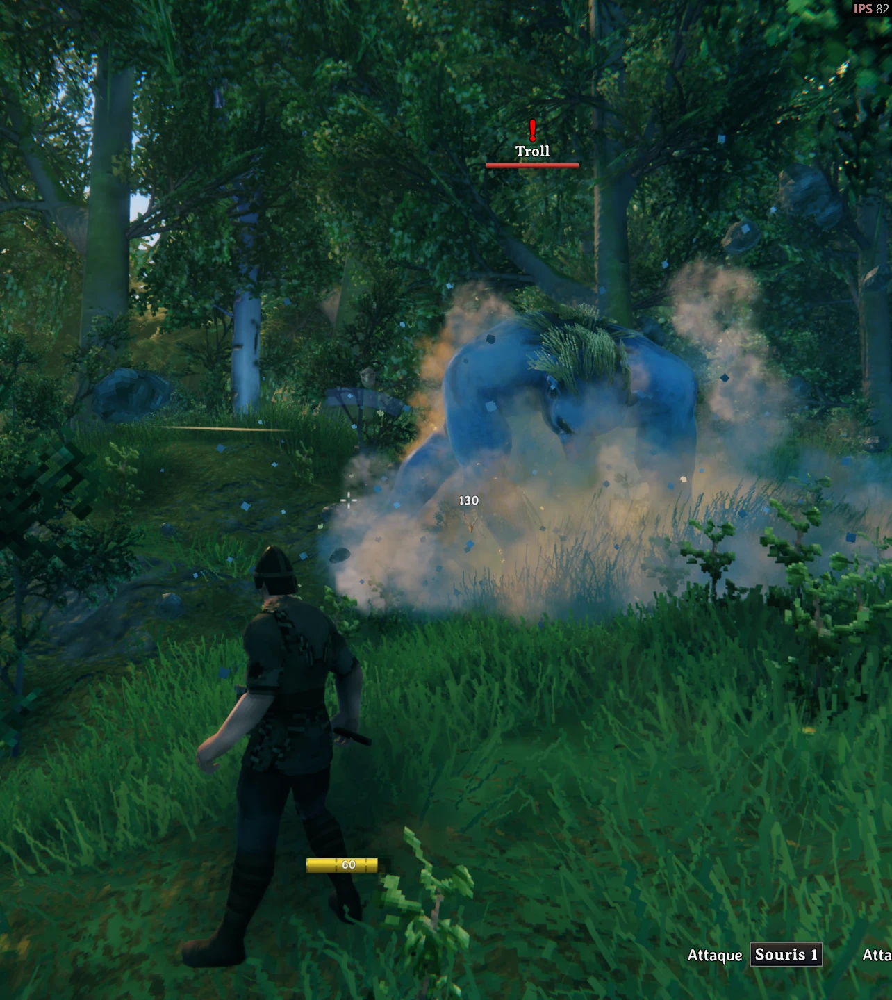

# EyesOfHeimdall

> *Heimdall entend l'herbe pousser et voit à des centaines de kilomètres. Ce mod prête un peu de ça à quelqu'un qui n'a qu'une oreille.*

Un mod Valheim qui **rend visible la direction des sons** — pour un joueur qui
n'entend que d'une oreille et n'a donc aucun repère interaural (ITD/ILD) pour
savoir d'où vient un bruit. Ce n'est pas un radar permanent façon wallhack :
rien ne s'affiche tant qu'aucun son ne se produit. Chaque son fait apparaître
un arc bref autour du viseur, dans la bonne direction, avec l'icône réelle de
la créature qui l'a émis.

## En jeu

<p align="center">
  
  &nbsp;&nbsp;
  
</p>

## Comment ça marche

- Un patch [Harmony](https://harmony.pardeike.net/) sur `ZSFX.Play()` (le
  système de sound effects de Valheim) observe chaque son joué dans le monde
  — sans jamais modifier le comportement du jeu.
- La créature à l'origine du son est identifiée via sa hiérarchie, ou, pour
  les effets d'impact/mort qui ne sont pas attachés à leur source (cas
  fréquent dans Valheim), via la créature vivante la plus proche du point
  sonore.
- Chaque créature du jeu (base + Mistlands/Ashlands/Deep North, ~160
  entités) est cataloguée avec une couleur, et son **icône de trophée réelle**
  est extraite de l'atlas d'icônes du jeu pour l'affichage — pas de nom
  technique, pas de texte : si aucune icône n'est disponible, rien ne
  s'affiche plutôt qu'un indice bancal.
- Plusieurs sons d'une même créature (pas, grognement, coup...) fusionnent en
  un seul repère plutôt que de s'empiler.
- Le cœur du calcul (direction/distance, cycle de vie des sons affichés) est
  agnostique du moteur de jeu — le mod Valheim n'est qu'un connecteur
  au-dessus.

## Installation (joueur)

Le mod fonctionne uniquement côté client : inutile que les autres joueurs
d'une même partie l'aient aussi installé.

**Le plus simple** : télécharge le zip de la dernière
[Release](../../releases/latest), dézippe-le, ferme Valheim s'il est ouvert,
double-clique `Installer.bat`. Le script trouve Valheim tout seul dans la
plupart des cas (sinon il demande le chemin), installe
[BepInEx](https://valheim.thunderstore.io/package/denikson/BepInExPack_Valheim/)
s'il n'est pas déjà présent, puis dépose le mod. Pour désinstaller :
`Desinstaller.bat` dans le même dossier.

Les scripts eux-mêmes sont dans [`installer/`](installer/) si tu préfères
les lire avant de les lancer, ou les adapter — il te faudra alors compiler
le mod toi-même (voir plus bas) et placer les deux DLL à côté des scripts.

### Options

Un bouton **EyesOfHeimdall** apparaît sur le bord gauche de l'écran-titre et
du menu pause (Échap). Il ouvre un panneau de réglages, avec un aperçu en
direct des arcs autour du viseur :

- afficher ou masquer les repères sonores, sans désinstaller le mod ;
- cacher ses propres sons (pas, coups...) ;
- portée de détection, taille du cercle, taille des icônes, opacité des arcs ;
- bestiaire : afficher « ??? » tant qu'un type de créature n'a pas été frappé,
  et le remettre à zéro pour une nouvelle partie ;
- mise à jour automatique.

Les mêmes réglages sont enregistrés dans
`BepInEx/config/com.eyesofheimdall.valheim.cfg` et restent modifiables à la
main.

### Mise à jour automatique

Une dizaine de secondes après le lancement du jeu, le mod consulte la dernière
release de ce dépôt (une seule petite requête). S'il en existe une plus
récente, il vérifie que son manifeste est **signé avec la clé de publication
du projet** (clé publique embarquée dans le mod, clé privée absente de
GitHub), télécharge les DLL, contrôle leur SHA-256, puis remplace les fichiers
installés (les précédents sont gardés en `.bak`). La nouvelle version s'active
au lancement suivant. Sans internet, ou si quoi que ce soit échoue, rien n'est
modifié.

À savoir avant d'installer : cela revient à faire confiance à l'auteur du mod
pour exécuter du code sur ta machine. Si tu préfères mettre à jour à la main,
décoche « Mise à jour automatique » dans les options.

## Build (dev)

Prérequis : SDK .NET, Valheim installé, BepInEx installé dans le dossier du
jeu.

```bash
dotnet build src/EyesOfHeimdall.ValheimMod/EyesOfHeimdall.ValheimMod.csproj -c Release
```

Le build copie automatiquement le mod dans
`<Valheim>/BepInEx/plugins/EyesOfHeimdall/` (chemin par défaut dans le
`.csproj`, override avec `-p:ValheimDir=...`). Logs :
`<Valheim>/BepInEx/LogOutput.log`.

### Publier une version

1. Incrémenter `Plugin.Version` (source unique du numéro de version),
   committer, pousser.
2. `powershell -File scripts/release.ps1 -NotesFile <notes.md> [-Title "..."]`

Le script compile, génère `update-manifest.txt` (version + SHA-256 des DLL),
le signe (`update-manifest.txt.sig`), assemble le zip d'installation et publie
le tout. C'est ce manifeste signé que les copies installées consultent pour se
mettre à jour : ne pas publier de release à la main sans lui.

La clé privée de signature vit hors du dépôt, dans
`%USERPROFILE%\.eyesofheimdall\release-signing-key.xml` (créée une fois avec
`scripts/new-signing-key.ps1`). **Elle est à sauvegarder** : les copies
installées n'acceptent que les mises à jour signées par elle, donc la perdre
oblige à réinstaller le mod à la main partout. Un fork doit générer sa propre
clé et remplacer la clé publique dans `UpdateSignature.cs`.

## Architecture

```
src/
  EyesOfHeimdall.Core/        agnostique du moteur — modèle de "sons actifs",
                               calcul direction/distance
  EyesOfHeimdall.ValheimMod/  connecteur Valheim (BepInEx/Harmony) : patch
                               ZSFX, catalogue de créatures, rendu overlay
```

L'idée à terme : un seul cœur, plusieurs connecteurs moteur — Valheim est le
premier, pas le seul visé.

## Pistes

- Distinguer danger réel (créature hostile en chasse) vs bruit de fond
  (faune passive/fuyante).
- Retour haptique directionnel (vibration manette asymétrique gauche/droite).
- Indiquer si un son se rapproche ou s'éloigne dans le temps.
- Deuxième connecteur moteur pour valider l'architecture "un cœur, plusieurs
  moteurs".

## Origine du projet

Cadré et fait mûrir avec [BMAD-METHOD](https://github.com/bmad-code-org/BMAD-METHOD)
avant l'implémentation — le journal de la session de brainstorming est dans
[`_bmad-output/`](_bmad-output/).
